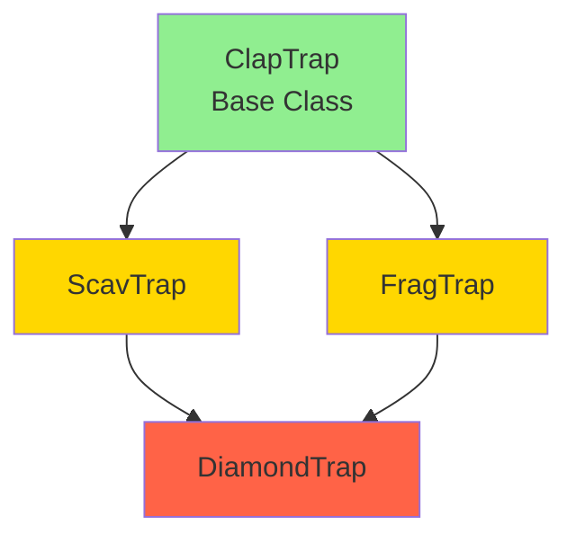
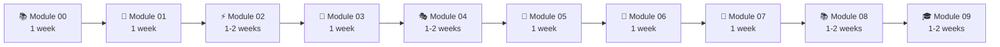
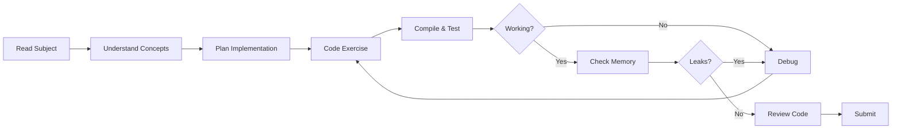
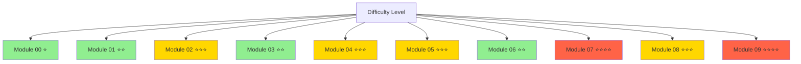
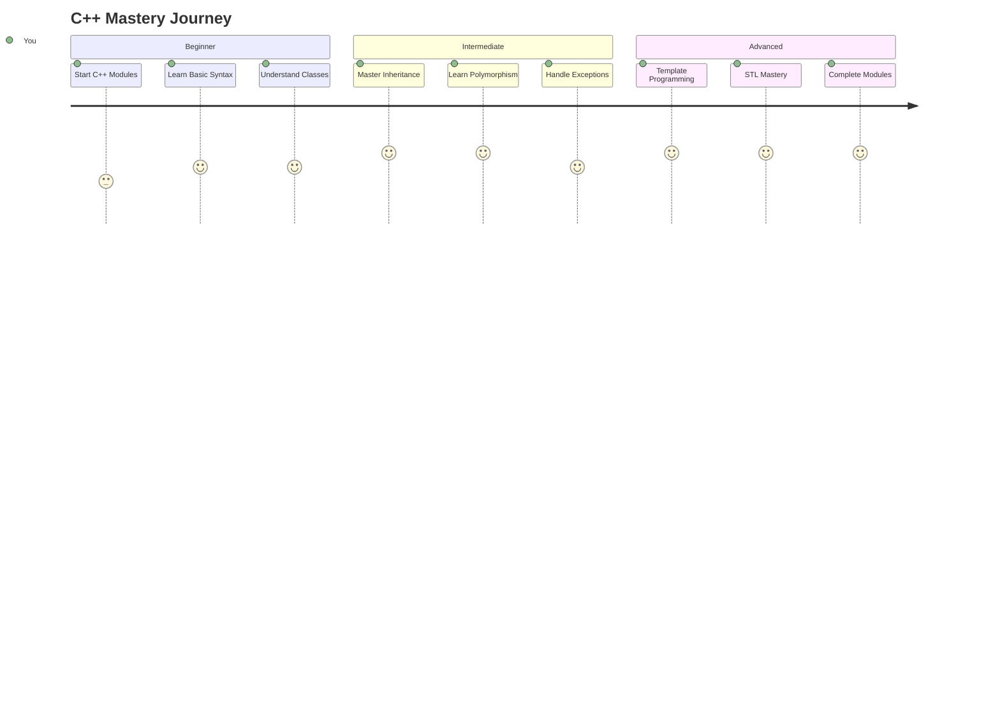

<h1 div="align="center" ></h1>
<div align="center">
  
</div>

<div align="center">


**A comprehensive collection of exercises designed to master the fundamentals of C++ programming**

[Quick Start](#-quick-start) • [Modules](#-modules-overview) • [Resources](#-resources) • [Contributing](#-contributing)

</div>

---

## 📋 Table of Contents

- [About](#-about)
- [Modules Overview](#️-modules-overview)
- [Foundation Level](#-foundation-level-modules-00-02)
- [Intermediate Level](#-intermediate-level-modules-03-04)
- [Advanced Level](#-advanced-level-modules-05-09)
- [Quick Start](#-quick-start)
- [Learning Path](#-learning-path)
- [Key Concepts](#-key-concepts)
- [Resources](#-resources)
- [Contributing](#-contributing)

---

## 🎯 About

The **42 C++ Modules** represent a carefully curated learning path through the intricacies of C++ programming. Following the renowned **42 School curriculum**, this project takes you on a journey from basic syntax to advanced programming paradigms.

> 🎯 **Goal**: Not just to learn C++ syntax, but to truly understand the *why* and *how* behind Object-Oriented Programming, memory management, and modern C++ practices.

<div align="center" >
**What You'll Learn:**
- ✅ Object-Oriented Programming fundamentals
- ✅ Memory management and RAII principles
- ✅ Polymorphism and inheritance
- ✅ STL containers and algorithms
- ✅ Exception handling and templates
- ✅ Modern C++ best practices
</div>
---

## 🗺️ Modules Overview

<div align="center">

```mermaid
```mermaid
graph TD
    A[Module 00<br/>C++ Basics] --> B[Module 01<br/>Memory & References]
    B --> C[Module 02<br/>Polymorphism Intro]
    C --> D[Module 03<br/>Inheritance]
    D --> E[Module 04<br/>Abstract Classes]
    E --> F[Module 05<br/>Exceptions]
    F --> G[Module 06<br/>Casts]
    G --> H[Module 07<br/>Templates]
    H --> I[Module 08<br/>STL]
    I --> J[Module 09<br/>STL Advanced]

    style A fill:#ffffff,stroke:#000000
    style B fill:#ffffff,stroke:#000000
    style C fill:#ffffff,stroke:#000000
    style D fill:#ffffff,stroke:#000000
    style E fill:#ffffff,stroke:#000000
    style F fill:#ffffff,stroke:#000000
    style G fill:#ffffff,stroke:#000000
    style H fill:#ffffff,stroke:#000000
    style I fill:#ffffff,stroke:#000000
    style J fill:#ffffff,stroke:#000000

</div>

---

<h2 div=align="center" > 🟢 Foundation Level (Modules 00-02) </h2>
<div align ="center" >
<details>
<summary>📦 <strong>Module 00 - C++ Basics</strong></summary>

### Topics Covered:
- Namespaces
- Classes and objects
- Member functions
- Stdio streams
- Initialization lists
- Static members
- Const members

### Key Exercises:

| Exercise | Description | Key Concepts |
|----------|-------------|--------------|
| **ex00** | Megaphone | String manipulation, toupper |
| **ex01** | PhoneBook | Classes, arrays, encapsulation |
| **ex02** | Account | Static members, timestamps |

### Example Code:
```cpp
// ex01: PhoneBook class structure
class PhoneBook {
private:
    Contact contacts[8];
    int     currentIndex;
    int     totalContacts;

public:
    PhoneBook();
    void addContact(const Contact& contact);
    void searchContacts() const;
    void displayContact(int index) const;
};
```

### Learning Outcomes:
- ✅ Understand class structure and encapsulation
- ✅ Master basic I/O operations
- ✅ Learn about member functions and data hiding

</details>

<details>
<summary>🧠 <strong>Module 01 - Memory & References</strong></summary>

### Topics Covered:
- Memory allocation (new/delete)
- Pointers vs references
- Switch statements
- File streams
- String manipulation

### Key Exercises:

| Exercise | Description | Key Concepts |
|----------|-------------|--------------|
| **ex00** | BraiiiiinnzZ | Pointers, references |
| **ex01** | Moar brainz! | Dynamic allocation |
| **ex02** | HI THIS IS BRAIN | Memory addresses |
| **ex03** | Unnecessary violence | References in classes |
| **ex04** | Sed is for losers | File I/O, string replace |
| **ex05** | Harl 2.0 | Pointers to member functions |
| **ex06** | Harl filter | Switch statements |

### Example Code:
```cpp
// ex03: Weapon class with reference
class Weapon {
private:
    std::string type;

public:
    Weapon(const std::string& type);
    const std::string& getType() const;
    void setType(const std::string& type);
};

class HumanB {
private:
    std::string name;
    Weapon*     weapon;  // Pointer (optional weapon)

public:
    HumanB(const std::string& name);
    void setWeapon(Weapon& weapon);
    void attack() const;
};
```

### Learning Outcomes:
- ✅ Understand pointer vs reference differences
- ✅ Master dynamic memory management
- ✅ Learn file I/O operations

</details>

<details>
<summary>⚡ <strong>Module 02 - Polymorphism Introduction</strong></summary>

### Topics Covered:
- Ad-hoc polymorphism
- Operator overloading
- Orthodox Canonical Form
- Fixed-point numbers

### Key Exercises:

| Exercise | Description | Key Concepts |
|----------|-------------|--------------|
| **ex00** | First Orthodox Class | Canonical form basics |
| **ex01** | Fixed Point | Operator overloading |
| **ex02** | BSP | Binary Space Partitioning |
| **ex03** | Point and BSP | Advanced operators |

### Orthodox Canonical Form:
```cpp
class Fixed {
private:
    int              _value;
    static const int _fractionalBits = 8;

public:
    // Orthodox Canonical Form
    Fixed();                              // Default constructor
    Fixed(const Fixed& other);            // Copy constructor
    Fixed& operator=(const Fixed& other); // Copy assignment operator
    ~Fixed();                             // Destructor

    // Additional constructors
    Fixed(const int value);
    Fixed(const float value);

    // Conversion functions
    float toFloat() const;
    int   toInt() const;

    // Comparison operators
    bool operator>(const Fixed& other) const;
    bool operator<(const Fixed& other) const;
    bool operator>=(const Fixed& other) const;
    bool operator<=(const Fixed& other) const;
    bool operator==(const Fixed& other) const;
    bool operator!=(const Fixed& other) const;

    // Arithmetic operators
    Fixed operator+(const Fixed& other) const;
    Fixed operator-(const Fixed& other) const;
    Fixed operator*(const Fixed& other) const;
    Fixed operator/(const Fixed& other) const;

    // Increment/Decrement operators
    Fixed& operator++();    // Pre-increment
    Fixed  operator++(int); // Post-increment
    Fixed& operator--();    // Pre-decrement
    Fixed  operator--(int); // Post-decrement

    // Static member functions
    static Fixed& min(Fixed& a, Fixed& b);
    static const Fixed& min(const Fixed& a, const Fixed& b);
    static Fixed& max(Fixed& a, Fixed& b);
    static const Fixed& max(const Fixed& a, const Fixed& b);
};

// Stream insertion operator
std::ostream& operator<<(std::ostream& out, const Fixed& fixed);
```

### Learning Outcomes:
- ✅ Master the Orthodox Canonical Form
- ✅ Understand operator overloading
- ✅ Learn fixed-point arithmetic

</details>
</div>
---

## 🟡 Intermediate Level (Modules 03-04)

<details>
<summary>🔗 <strong>Module 03 - Inheritance</strong></summary>

### Topics Covered:
- Class inheritance
- Protected access specifier
- Virtual functions
- Multiple inheritance (diamond problem)

### Key Exercises:

| Exercise | Description | Key Concepts |
|----------|-------------|--------------|
| **ex00** | ClapTrap | Base class creation |
| **ex01** | ScavTrap | Single inheritance |
| **ex02** | FragTrap | Multiple derived classes |
| **ex03** | DiamondTrap | Diamond inheritance |

### Inheritance Hierarchy:


### Example Code:
```cpp
// Base class
class ClapTrap {
protected:
    std::string _name;
    int         _hitPoints;
    int         _energyPoints;
    int         _attackDamage;

public:
    ClapTrap(const std::string& name);
    virtual ~ClapTrap();
    
    virtual void attack(const std::string& target);
    void takeDamage(unsigned int amount);
    void beRepaired(unsigned int amount);
};

// Derived class
class ScavTrap : public ClapTrap {
public:
    ScavTrap(const std::string& name);
    ~ScavTrap();
    
    void attack(const std::string& target); // Override
    void guardGate();
};

// Diamond inheritance
class DiamondTrap : public ScavTrap, public FragTrap {
private:
    std::string _name;

public:
    DiamondTrap(const std::string& name);
    ~DiamondTrap();
    
    void whoAmI();
};
```

### Learning Outcomes:
- ✅ Understand inheritance hierarchies
- ✅ Learn virtual functions and polymorphism
- ✅ Solve the diamond problem with virtual inheritance

</details>

<details>
<summary>🎭 <strong>Module 04 - Abstract Classes & Interfaces</strong></summary>

### Topics Covered:
- Subtype polymorphism
- Abstract classes
- Pure virtual functions
- Interfaces
- Deep copy vs shallow copy

### Key Exercises:

| Exercise | Description | Key Concepts |
|----------|-------------|--------------|
| **ex00** | Polymorphism | Virtual functions |
| **ex01** | Brain | Deep copy |
| **ex02** | Abstract class | Pure virtual functions |
| **ex03** | Interface & recap | Interface design |

### Example Code:
```cpp
// Abstract base class (Interface)
class Animal {
protected:
    std::string _type;

public:
    Animal();
    virtual ~Animal();
    
    // Pure virtual function (makes class abstract)
    virtual void makeSound() const = 0;
    
    std::string getType() const;
};

// Concrete derived class
class Dog : public Animal {
private:
    Brain* _brain;  // Deep copy needed!

public:
    Dog();
    Dog(const Dog& other);
    Dog& operator=(const Dog& other);
    ~Dog();
    
    void makeSound() const; // Implementation required
};

// Interface example
class ICharacter {
public:
    virtual ~ICharacter() {}
    virtual std::string const& getName() const = 0;
    virtual void equip(AMateria* m) = 0;
    virtual void unequip(int idx) = 0;
    virtual void use(int idx, ICharacter& target) = 0;
};
```

### Learning Outcomes:
- ✅ Master abstract classes and interfaces
- ✅ Understand deep vs shallow copy
- ✅ Learn polymorphic behavior

</details>

---

## 🔴 Advanced Level (Modules 05-09)

<details>
<summary>🚨 <strong>Module 05 - Exceptions</strong></summary>

### Topics Covered:
- Try/catch blocks
- Exception classes
- Exception hierarchy
- Stack unwinding
- RAII and exceptions

### Key Exercises:

| Exercise | Description | Key Concepts |
|----------|-------------|--------------|
| **ex00** | Bureaucrat | Basic exceptions |
| **ex01** | Form | Exception in classes |
| **ex02** | Abstract forms | Inheritance + exceptions |
| **ex03** | Intern | Factory pattern with exceptions |

### Example Code:
```cpp
class Bureaucrat {
private:
    const std::string _name;
    int              _grade;

public:
    // Nested exception classes
    class GradeTooHighException : public std::exception {
    public:
        virtual const char* what() const throw();
    };

    class GradeTooLowException : public std::exception {
    public:
        virtual const char* what() const throw();
    };

    Bureaucrat(const std::string& name, int grade);
    ~Bureaucrat();

    void incrementGrade();
    void decrementGrade();
    void signForm(Form& form);
    void executeForm(Form const& form);
};

// Usage example
try {
    Bureaucrat bob("Bob", 0);  // Too high!
} catch (const Bureaucrat::GradeTooHighException& e) {
    std::cerr << "Error: " << e.what() << std::endl;
}
```

### Learning Outcomes:
- ✅ Master exception handling
- ✅ Create custom exception classes
- ✅ Understand exception safety

</details>

<details>
<summary>🎯 <strong>Module 06 - Type Casting</strong></summary>

### Topics Covered:
- Static cast
- Dynamic cast
- Const cast
- Reinterpret cast
- Type identification

### Key Exercises:

| Exercise | Description | Key Concepts |
|----------|-------------|--------------|
| **ex00** | Scalar conversion | Static cast |
| **ex01** | Serialization | Reinterpret cast |
| **ex02** | Type identification | Dynamic cast |

### Cast Types Comparison:

| Cast Type | Use Case | Safety | Example |
|-----------|----------|--------|---------|
| `static_cast` | Compile-time conversions | Medium | `static_cast<int>(3.14)` |
| `dynamic_cast` | Runtime polymorphic casting | High | `dynamic_cast<Derived*>(base)` |
| `const_cast` | Remove const qualifier | Low | `const_cast<char*>(str)` |
| `reinterpret_cast` | Low-level reinterpretation | Very Low | `reinterpret_cast<uintptr_t>(ptr)` |

### Example Code:
```cpp
// ex02: Type identification
class Base {
public:
    virtual ~Base() {}
};

class A : public Base {};
class B : public Base {};
class C : public Base {};

void identify(Base* p) {
    if (dynamic_cast<A*>(p))
        std::cout << "A" << std::endl;
    else if (dynamic_cast<B*>(p))
        std::cout << "B" << std::endl;
    else if (dynamic_cast<C*>(p))
        std::cout << "C" << std::endl;
}

void identify(Base& p) {
    try {
        (void)dynamic_cast<A&>(p);
        std::cout << "A" << std::endl;
        return;
    } catch (std::exception&) {}
    
    try {
        (void)dynamic_cast<B&>(p);
        std::cout << "B" << std::endl;
        return;
    } catch (std::exception&) {}
    
    std::cout << "C" << std::endl;
}
```

### Learning Outcomes:
- ✅ Understand different cast types
- ✅ Know when to use each cast
- ✅ Master type identification

</details>

<details>
<summary>📐 <strong>Module 07 - Templates</strong></summary>

### Topics Covered:
- Function templates
- Class templates
- Template specialization
- Template instantiation

### Key Exercises:

| Exercise | Description | Key Concepts |
|----------|-------------|--------------|
| **ex00** | Start with templates | Function templates |
| **ex01** | Iter | Template iteration |
| **ex02** | Array | Class templates |

### Example Code:
```cpp
// Function template
template <typename T>
void swap(T& a, T& b) {
    T temp = a;
    a = b;
    b = temp;
}

template <typename T>
T const& min(T const& a, T const& b) {
    return (a < b) ? a : b;
}

template <typename T>
T const& max(T const& a, T const& b) {
    return (a > b) ? a : b;
}

// Class template
template <typename T>
class Array {
private:
    T*           _elements;
    unsigned int _size;

public:
    Array();
    Array(unsigned int n);
    Array(const Array& other);
    Array& operator=(const Array& other);
    ~Array();

    T& operator[](unsigned int index);
    const T& operator[](unsigned int index) const;
    
    unsigned int size() const;

    class OutOfBoundsException : public std::exception {
    public:
        virtual const char* what() const throw();
    };
};

// Usage
Array<int> numbers(5);
Array<std::string> strings(3);
```

### Learning Outcomes:
- ✅ Master function and class templates
- ✅ Understand template instantiation
- ✅ Learn generic programming

</details>

<details>
<summary>📚 <strong>Module 08 - STL Containers</strong></summary>

### Topics Covered:
- STL containers (vector, list, deque, stack)
- Iterators
- Algorithms
- Container adapters

### Key Exercises:

| Exercise | Description | Key Concepts |
|----------|-------------|--------------|
| **ex00** | Easy find | Algorithm usage |
| **ex01** | Span | Container manipulation |
| **ex02** | Mutated abomination | Stack container |

### STL Containers Overview:

```cpp
#include <vector>
#include <list>
#include <stack>
#include <algorithm>

// ex00: Finding elements
template <typename T>
typename T::iterator easyfind(T& container, int value) {
    typename T::iterator it = std::find(container.begin(), 
                                        container.end(), 
                                        value);
    if (it == container.end())
        throw std::exception();
    return it;
}

// ex01: Span class
class Span {
private:
    unsigned int       _maxSize;
    std::vector<int>   _numbers;

public:
    Span(unsigned int N);
    
    void addNumber(int number);
    void addRange(std::vector<int>::iterator begin, 
                  std::vector<int>::iterator end);
    
    int shortestSpan() const;
    int longestSpan() const;
};

// ex02: Stack-based operations
template <typename T>
class MutantStack : public std::stack<T> {
public:
    typedef typename std::stack<T>::container_type::iterator iterator;
    
    iterator begin() { return this->c.begin(); }
    iterator end() { return this->c.end(); }
};
```

### Common STL Algorithms:
```cpp
std::find()      // Find element
std::sort()      // Sort container
std::count()     // Count elements
std::copy()      // Copy elements
std::for_each()  // Apply function to each
std::transform() // Transform elements
std::accumulate()// Sum/accumulate values
```

### Learning Outcomes:
- ✅ Master STL containers
- ✅ Understand iterators
- ✅ Use STL algorithms effectively

</details>

<details>
<summary>🎓 <strong>Module 09 - Advanced STL</strong></summary>

### Topics Covered:
- STL algorithms (advanced)
- Function objects (functors)
- Predicates
- Container performance
- Custom comparators

### Key Exercises:

| Exercise | Description | Key Concepts |
|----------|-------------|--------------|
| **ex00** | Bitcoin Exchange | Map container |
| **ex01** | RPN Calculator | Stack operations |
| **ex02** | PmergeMe | Sorting algorithms |

### Example Code:
```cpp
// ex00: Bitcoin Exchange using std::map
class BitcoinExchange {
private:
    std::map<std::string, double> _database;

public:
    BitcoinExchange(const std::string& filename);
    
    double getRate(const std::string& date) const;
    void processInput(const std::string& filename);
};

// ex01: RPN Calculator using std::stack
class RPN {
private:
    std::stack<double> _stack;

public:
    double evaluate(const std::string& expression);
    
private:
    bool isOperator(char c) const;
    void performOperation(char op);
};

// ex02: Performance comparison
class PmergeMe {
private:
    std::vector<int> _vector;
    std::deque<int>  _deque;

public:
    void sort(const std::string& input);
    
private:
    void fordJohnsonSort(std::vector<int>& container);
    void fordJohnsonSort(std::deque<int>& container);
    
    template <typename Container>
    void measureTime(Container& container, const std::string& name);
};
```

### Performance Considerations:

| Container | Access | Insertion | Deletion | Use Case |
|-----------|--------|-----------|----------|----------|
| `vector` | O(1) | O(n) | O(n) | Random access, append |
| `deque` | O(1) | O(1) both ends | O(n) | Both ends operations |
| `list` | O(n) | O(1) | O(1) | Frequent insertions |
| `map` | O(log n) | O(log n) | O(log n) | Key-value pairs |
| `set` | O(log n) | O(log n) | O(log n) | Unique sorted elements |

### Learning Outcomes:
- ✅ Master advanced STL usage
- ✅ Understand container performance
- ✅ Learn algorithm optimization

</details>

---

## 🚀 Quick Start

### Prerequisites
```bash
# Required
- C++ compiler (g++ or clang++)
- Make
- Git

# Recommended
- GDB (debugging)
- Valgrind (memory leak detection)
```

### Compilation
```bash
# Clone the repository
git clone https://github.com/yourusername/42-cpp-modules.git
cd 42-cpp-modules

# Navigate to specific module
cd Module_00/ex00

# Compile
make

# Run
./program_name

# Clean
make clean    # Remove object files
make fclean   # Remove object files and executable
make re       # Recompile everything
```

### 42 Norm Compliance
```bash
# Install norminette (if available)
pip install norminette

# Check compliance
norminette -R CheckForbiddenSourceHeader *.cpp *.hpp
```

---

## 📖 Learning Path

### Recommended Study Order:



### Time Investment:

| Module | Difficulty | Time Estimate | Focus Area |
|--------|-----------|---------------|------------|
| 00 | ⭐ Easy | 1 week | Basics |
| 01 | ⭐⭐ Medium | 1 week | Memory |
| 02 | ⭐⭐⭐ Medium-Hard | 1-2 weeks | Operators |
| 03 | ⭐⭐ Medium | 1 week | Inheritance |
| 04 | ⭐⭐⭐ Medium-Hard | 1-2 weeks | Polymorphism |
| 05 | ⭐⭐⭐ Medium-Hard | 1 week | Exceptions |
| 06 | ⭐⭐ Medium | 1 week | Casting |
| 07 | ⭐⭐⭐⭐ Hard | 1 week | Templates |
| 08 | ⭐⭐⭐ Medium-Hard | 1-2 weeks | STL Basics |
| 09 | ⭐⭐⭐⭐ Hard | 1-2 weeks | STL Advanced |

**Total Time: 10-15 weeks (2.5-4 months)**

---

## 🔑 Key Concepts

### The Four Pillars of OOP

<details>
<summary>🏛️ <strong>1. Encapsulation</strong></summary>

**Definition:** Bundling data and methods that operate on that data within a single unit (class).

```cpp
class BankAccount {
private:
    double balance;  // Hidden from outside access
    
public:
    void deposit(double amount) {
        if (amount > 0)
            balance += amount;
    }
    
    double getBalance() const {
        return balance;
    }
};
```

**Benefits:**
- Data hiding
- Controlled access
- Easier maintenance
</details>

<details>
<summary>🧬 <strong>2. Inheritance</strong></summary>

**Definition:** Mechanism to create new classes from existing ones.

```cpp
class Vehicle {
protected:
    int speed;
    
public:
    void accelerate() { speed += 10; }
};

class Car : public Vehicle {
private:
    int numberOfDoors;
    
public:
    void openDoor() { /* ... */ }
};
```

**Types:**
- Single inheritance
- Multiple inheritance
- Hierarchical inheritance
- Virtual inheritance (diamond problem)
</details>

<details>
<summary>🎭 <strong>3. Polymorphism</strong></summary>

**Definition:** Ability to take multiple forms.

```cpp
class Animal {
public:
    virtual void makeSound() = 0;  // Pure virtual
    virtual ~Animal() {}
};

class Dog : public Animal {
public:
    void makeSound() { std::cout << "Woof!" << std::endl; }
};

class Cat : public Animal {
public:
    void makeSound() { std::cout << "Meow!" << std::endl; }
};

// Usage
Animal* animal = new Dog();
animal->makeSound();  // Outputs: Woof!
```

**Types:**
- Compile-time (overloading)
- Runtime (virtual functions)
</details>

<details>
<summary>🔒 <strong>4. Abstraction</strong></summary>

**Definition:** Hiding complex implementation details, showing only essential features.

```cpp
class Shape {
public:
    virtual double area() const = 0;
    virtual double perimeter() const = 0;
    virtual ~Shape() {}
};

class Circle : public Shape {
private:
    double radius;
    
public:
    Circle(double r) : radius(r) {}
    
    double area() const {
        return 3.14159 * radius * radius;
    }
    
    double perimeter() const {
        return 2 * 3.14159 * radius;
    }
};
```

**Benefits:**
- Simplified interface
- Reduced complexity
- Increased security
</details>

---

## 📚 Resources

### 📖 Essential Books

| Book | Author | Focus | Level |
|------|--------|-------|-------|
| **C++ Primer** | Stanley Lippman | Comprehensive intro | Beginner |
| **Effective C++** | Scott Meyers | Best practices | Intermediate |
| **More Effective C++** | Scott Meyers | Advanced techniques | Intermediate |
| **Effective Modern C++** | Scott Meyers | C++11/14 features | Advanced |
| **The C++ Programming Language** | Bjarne Stroustrup | Complete reference | All levels |

### 🌐 Online Resources

<div align="center">

| Resource | Link | Description |
|----------|------|-------------|
| 📚 **42 Intranet** | [intra.42.fr](https://intra.42.fr) | Official 42 resources |
| 📖 **C++ Reference** | [cppreference.com](https://cppreference.com) | Complete C++ documentation |
| 🎓 **Learn C++** | [learncpp.com](https://learncpp.com) | Free C++ tutorials |
| 📝 **42 Norm** | [42 Norm PDF](https://github.com/42School/norminette) | Coding standards |
| 🎥 **The Cherno** | [YouTube](https://youtube.com/c/TheChernoProject) | C++ video series |
| 📺 **CppCon** | [YouTube](https://youtube.com/user/CppCon) | Conference talks |

</div>

### 🛠️ Useful Tools

```bash
# Debugging
gdb ./program              # GNU Debugger
lldb ./program            # LLVM Debugger

# Memory leak detection
valgrind --leak-check=full ./program

# Code analysis
cppcheck --enable=all *.cpp

# Formatting (if allowed)
clang-format -i *.cpp *.hpp

# Static analysis
clang-tidy *.cpp -- -std=c++98
```

### 💡 Pro Tips

<details>
<summary><strong>Debugging Tips</strong></summary>

```bash
# Compile with debug symbols
g++ -g -Wall -Wextra -Werror -std=c++98 *.cpp

# Common GDB commands
(gdb) break main          # Set breakpoint
(gdb) run                 # Start program
(gdb) next               # Next line
(gdb) step               # Step into function
(gdb) print variable     # Print value
(gdb) backtrace          # Show call stack

# Valgrind for memory leaks
valgrind --leak-check=full \
         --show-leak-kinds=all \
         --track-origins=yes \
         ./program
```
</details>

<details>
<summary><strong>Common Pitfalls to Avoid</strong></summary>

❌ **Don't:**
```cpp
// Forgetting virtual destructor
class Base {
    ~Base() {}  // Should be virtual!
};

// Returning reference to local variable
std::string& getTemp() {
    std::string temp = "Bad";
    return temp;  // Dangling reference!
}

// Not checking dynamic_cast result
Derived* d = dynamic_cast<Derived*>(base);
d->method();  // Could crash if d is NULL!
```

✅ **Do:**
```cpp
// Virtual destructor in base class
class Base {
    virtual ~Base() {}
};

// Return by value or use static
std::string getTemp() {
    return std::string("Good");
}

// Check dynamic_cast result
Derived* d = dynamic_cast<Derived*>(base);
if (d)
    d->method();
```
</details>

---

## 🎯 Study Tips

### For Each Module:

1. **📖 Read the PDF Carefully**
   - Understand the requirements
   - Note the restrictions
   - Check allowed functions

2. **💭 Plan Before Coding**
   - Design your class hierarchy
   - Think about edge cases
   - Consider memory management

3. **✍️ Code Incrementally**
   - Start with basic functionality
   - Test each part separately
   - Add features gradually

4. **🧪 Test Thoroughly**
   - Test with valid inputs
   - Test with invalid inputs
   - Test edge cases
   - Check for memory leaks

5. **📝 Document Your Code**
   - Write clear comments
   - Explain complex logic
   - Document assumptions

### Recommended Practice Routine:



---

## 🤝 Contributing

Contributions are welcome! Here's how you can help:

### How to Contribute:

1. **Fork** the repository
2. **Create** a feature branch (`git checkout -b feature/amazing-feature`)
3. **Commit** your changes (`git commit -m 'Add some amazing feature'`)
4. **Push** to the branch (`git push origin feature/amazing-feature`)
5. **Open** a Pull Request

### Contribution Guidelines:

- ✅ Follow the 42 Norm
- ✅ Test your code thoroughly
- ✅ Add comments for complex logic
- ✅ Update README if needed
- ✅ No memory leaks!

### Areas for Contribution:

- 📝 Additional explanations
- 🎯 More example code
- 🐛 Bug fixes
- 📚 Resource recommendations
- 🌍 Translations

---

## ⚠️ Important Notes

### 42 Norm Restrictions:

```cpp
// ❌ NOT ALLOWED
using namespace std;        // No 'using namespace'
for (int i = 0; ...)       // No for loops (some modules)
printf()                   // No C functions (use cout)
*alloc(), free()          // No C memory functions

// ✅ ALLOWED
std::cout                  // Explicit namespace
while (...)               // While loops OK
new/delete               // C++ memory management
std::vector              // STL containers (later modules)
```

### Academic Integrity:

> ⚠️ **Warning**: This repository is for educational purposes. Copying code without understanding violates 42's academic integrity policy.

**Use this repo to:**
- ✅ Understand concepts
- ✅ Compare approaches
- ✅ Learn from examples
- ✅ Get unstuck

**Don't:**
- ❌ Copy-paste solutions
- ❌ Submit without understanding
- ❌ Share during evaluations

---

## 🏆 Progress Tracker

Track your progress through the modules:

- [ ] Module 00 - C++ Basics
- [ ] Module 01 - Memory & References  
- [ ] Module 02 - Polymorphism Intro
- [ ] Module 03 - Inheritance
- [ ] Module 04 - Abstract Classes
- [ ] Module 05 - Exceptions
- [ ] Module 06 - Type Casting
- [ ] Module 07 - Templates
- [ ] Module 08 - STL Containers
- [ ] Module 09 - Advanced STL

### Validation Checklist:

For each exercise:
- [ ] Compiles without errors
- [ ] Compiles without warnings
- [ ] Follows 42 Norm
- [ ] No memory leaks (Valgrind clean)
- [ ] Handles edge cases
- [ ] Has Orthodox Canonical Form (where required)
- [ ] Tested thoroughly

---

## 📊 Module Difficulty Chart



---

## 💬 FAQ

<details>
<summary><strong>Q: Can I use C++11/14/17 features?</strong></summary>

A: No, 42 C++ modules require C++98 standard. Use `-std=c++98` flag.
</details>

<details>
<summary><strong>Q: Why no STL in early modules?</strong></summary>

A: To understand fundamentals. You'll implement your own containers before using STL.
</details>

<details>
<summary><strong>Q: How to handle the Orthodox Canonical Form?</strong></summary>

A: Every class needs:
1. Default constructor
2. Copy constructor
3. Copy assignment operator
4. Destructor
</details>

<details>
<summary><strong>Q: What about memory leaks?</strong></summary>

A: Use Valgrind to check. Follow RAII principle. Every `new` needs a corresponding `delete`.
</details>

<details>
<summary><strong>Q: How long does it take to complete all modules?</strong></summary>

A: Typically 2.5-4 months if studying full-time, longer part-time. Quality over speed!
</details>

---

## 📞 Support & Community

### Get Help:

- 💬 **Slack** - Join your campus C++ channel
- 🤝 **Peer Learning** - Form study groups
- 📚 **Stack Overflow** - [C++ tag](https://stackoverflow.com/questions/tagged/c++)
- 🎮 **Discord** - 42 community servers

### Useful Links:

- [42 Subject PDFs](https://github.com/42School)
- [C++ Core Guidelines](https://isocpp.github.io/CppCoreGuidelines/)
- [Google C++ Style Guide](https://google.github.io/styleguide/cppguide.html)

---

## 📄 License

This project is licensed under the **MIT License** - see the [LICENSE](LICENSE) file for details.

---

## 🙏 Acknowledgments

Special thanks to:
- 🏫 **42 Network** - For the excellent curriculum
- 👥 **42 Community** - For peer support and collaboration
- 📚 **Contributors** - For improving this guide
- 🎓 **Open Source C++ Community** - For amazing resources

---

## 📈 Your Learning Journey



---

<div align="center">

**Made with ❤️ by the 42 Community**

*"The best way to learn C++ is to code C++"*

[](https://github.com/yourusername/42-cpp-modules/stargazers)
[](https://github.com/yourusername/42-cpp-modules/network/members)

### 🚀 Happy Coding!

[⬆ Back to Top](#️-42-c-modules-️)

</div>
