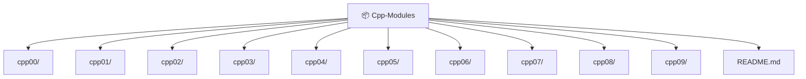

<div align="center">
  <h3>C++ Modules from the 42 School</h3>
</div>
<div align="center">
  
</div>

A collection of solutions and notes for the C++ Modules from the 42 School curriculum.

---

## About

This repository follows the official 42 C++ curriculum, covering the language from the basics of object-oriented programming to templates, the STL, and generic programming.

The goal of these modules is to build a solid understanding of C++ by writing code rather than relying on external libraries or modern language features. All projects follow the C++98 standard, encouraging a deeper understanding of memory management, inheritance, polymorphism, exceptions, and templates.

---
## C++ Modules Roadmap

```mermaid
flowchart TB

    START([🚀 Begin C++])

    START --> CPP00
    CPP00 --> CPP01
    CPP01 --> CPP02
    CPP02 --> CPP03
    CPP03 --> CPP04
    CPP04 --> CPP05
    CPP05 --> CPP06
    CPP06 --> CPP07
    CPP07 --> CPP08
    CPP08 --> CPP09
    CPP09 --> END([🏆 Complete])

    CPP00["CPP00<br/>This first module of C++ is designed to help you understand the specificities of the language when compared to C. Time to dive into Object-Oriented Programming!"]
    CPP01["CPP01<br/>This module is designed to help you understand memory allocation, references, pointers to members, and the usage of the switch statement in C++."]
    CPP02["CPP02<br/>This module is designed to help you understand ad-hoc polymorphism, function overloading, and orthodox canonical classes in C++."]
    CPP03["CPP03<br/>This module is designed to help you understand inheritance in C++."]
    CPP04["CPP04<br/>This module is designed to help you understand subtype polymorphism, abstract classes, and interfaces in C++."]
    CPP05["CPP05<br/>This module is designed to help you understand try/catch and exceptions in C++."]
    CPP06["CPP06<br/>This module is designed to help you understand the different types of casting in C++."]
    CPP07["CPP07<br/>This module is designed to help you understand templates in C++."]
    CPP08["CPP08<br/>This module is designed to help you understand templated containers, iterators, and algorithms in C++."]
    CPP09["CPP09<br/>This module is designed to help you understand containers in C++."]
```



---

## Repository Structure



Each module contains the exercises required by the subject along with a Makefile and the necessary source files.

---

## Requirements

- C++98 compatible compiler
- GNU Make
- Linux or macOS

Example:

```bash
cd cpp00/ex00
make
./ex00
```

---

## References

- 42 Intranet — https://intra.42.fr
- cppreference — https://cppreference.com
- Learn C++ — https://www.learncpp.com

---

## License

This repository is released under the MIT License. See the [LICENSE](LICENSE) file for more information.
