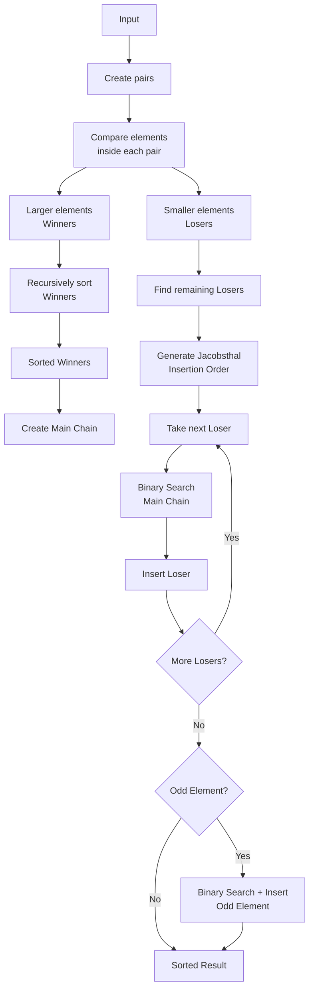

# PmergeMe ex02

## Overview

`PmergeMe` is a C++ sorting program implementing the **Ford–Johnson Merge-Insertion Sort algorithm**.

The program:

* Parses positive integers from the command line.
* Stores the numbers in both `std::vector` and `std::deque`.
* Sorts both containers using the Ford–Johnson algorithm.
* Uses **Jacobsthal numbers** to determine the insertion order.
* Uses **binary search** when inserting elements.
* Handles both even and odd numbers of elements.
* Measures and compares the processing time of `std::vector` and `std::deque`.

Example:

```bash
./PmergeMe 3 5 9 7 4
```

Output:

```text
Before: 3 5 9 7 4
After:  3 4 5 7 9
Time to process a range of 5 elements with std::vector : ...
Time to process a range of 5 elements with std::deque  : ...
```

---

# 1. Program Flow

The program follows this general pipeline:

```text
Command-line arguments
        |
        v
   Parse numbers
        |
        v
Store in vector + deque
        |
        +--------------------+
        |                    |
        v                    v
   Ford-Johnson        Ford-Johnson
      vector               deque
        |                    |
        v                    v
   Measure time          Measure time
        |                    |
        +---------+----------+
                  |
                  v
             Print result
```

---

# 2. Argument Parsing

Each command-line argument is converted from `std::string` to `int`.

For example:

```bash
./PmergeMe 3 5 9 7 4
```

The program receives:

```text
argv[1] = "3"
argv[2] = "5"
argv[3] = "9"
argv[4] = "7"
argv[5] = "4"
```

Each value is parsed and then added to both containers:

```cpp
pmergeMe.addNumber(number);
```

The `addNumber()` function performs:

```cpp
_vector.push_back(number);
_deque.push_back(number);
```

Therefore both containers initially contain exactly the same values.

---

# 3. Number Validation

`parseNumber()` validates every input before converting it to an integer.

The accepted rules are:

* Empty strings are rejected.
* Digits are accepted.
* `+` is accepted before a number.
* `-` is rejected.
* `0` is accepted.
* Values greater than `INT_MAX` are rejected.

Examples:

```text
123     -> valid
+123    -> valid
0       -> valid

-123    -> invalid
abc     -> invalid
12abc   -> invalid
""      -> invalid
2147483648 -> invalid
```

The implementation checks every character using `std::isdigit()` and builds the number manually.

It also checks for overflow while parsing:

```cpp
value = value * 10 + (str[i] - '0');

if (value > INT_MAX)
    throw std::out_of_range("Error");
```

This prevents an integer larger than `INT_MAX` from being converted into an invalid `int`.

---

# 4. Containers

The project uses two STL containers:

```cpp
std::vector<int>
std::deque<int>
```

The same sorting algorithm is implemented separately for both containers.

The getters return constant references:

```cpp
const std::vector<int>& getVector() const;
const std::deque<int>& getDeque() const;
```

In `main()`, copies are created before sorting:

```cpp
std::vector<int> vector = pmergeMe.getVector();
std::deque<int> deque = pmergeMe.getDeque();
```

This preserves the original input stored inside `PmergeMe`.

---

# 5. Ford–Johnson / Merge-Insertion Sort

The main sorting algorithm is **Ford–Johnson Merge-Insertion Sort**.

Its general strategy is:

```text
Input
  |
  v
Create pairs
  |
  v
Sort each pair
  |
  v
Separate winners and losers
  |
  v
Recursively sort winners
  |
  v
Create main chain
  |
  v
Insert losers using Jacobsthal order
  |
  v
Binary search for insertion positions
  |
  v
Insert possible odd element
  |
  v
Sorted result
```

The implementation follows these steps for both `vector` and `deque`.

---

# 6. Creating Pairs

The input is divided into pairs.

Example:

```text
8 3
7 2
6 9
5 1
```

Every pair is internally ordered so that the smaller value comes first:

```text
(3, 8)
(2, 7)
(6, 9)
(1, 5)
```

The comparison is performed with:

```cpp
if (first > second)
    std::swap(first, second);
```

Therefore every pair follows:

```text
loser <= winner
```

---

# 7. Winners and Losers

After sorting each pair, every pair contains:

```text
(smaller, larger)
   loser   winner
```

For:

```text
(3,8)
(2,7)
(6,9)
(1,5)
```

The winners are:

```text
8 7 9 5
```

The losers are:

```text
3 2 6 1
```

The winners are extracted and recursively sorted.

---

# 8. Recursive Sorting of Winners

The winners themselves are sorted using the same Ford–Johnson algorithm:

```cpp
fordJohnsonVector(winners);
```

or:

```cpp
fordJohnsonDeque(winners);
```

This recursion continues until the container contains zero or one element:

```cpp
if (v.size() <= 1)
    return;
```

At that point, the container is already sorted.

This is the recursive part of the algorithm:

```text
Original input
      |
      v
    Pairs
      |
      v
   Winners
      |
      v
Recursive Ford-Johnson
      |
      v
Sorted winners
```

---

# 9. Main Chain

After the winners have been recursively sorted, a **main chain** is created.

The loser associated with the smallest winner is inserted first.

For example, if:

```text
pairs:

(3,8)
(2,7)
(6,9)
(1,5)
```

and the sorted winners are:

```text
5 7 8 9
```

The winner `5` originally belonged to:

```text
(1,5)
```

Therefore its corresponding loser is:

```text
1
```

The main chain begins with:

```text
1
```

Then the sorted winners are appended:

```text
1 5 7 8 9
```

This gives the initial sorted chain onto which the remaining losers will be inserted.

---

# 10. Remaining Losers

The remaining losers are collected according to their corresponding winners.

The first loser has already been inserted into the main chain, so it is skipped.

For example:

```text
Losers:

1 6 2 3
```

If `1` was already inserted, the remaining losers are:

```text
6 2 3
```

These elements are not inserted in normal order.

Instead, the program uses a **Jacobsthal insertion order**.

---

# 11. Jacobsthal Numbers

Jacobsthal numbers are used to determine the order in which the remaining losers are inserted.

The sequence is:

```text
J(0) = 0
J(1) = 1

J(n) = J(n - 1) + 2 * J(n - 2)
```

Which produces:

```text
0, 1, 1, 3, 5, 11, 21, 43, ...
```

The Ford–Johnson algorithm uses these numbers to divide loser insertion into groups.

Conceptually, the insertion order starts like:

```text
1
3, 2
5, 4
11, 10, 9, 8, 7, 6
...
```

The purpose is to reduce the number of comparisons required during binary insertion.

The implementation generates indices rather than directly generating values:

```cpp
std::vector<size_t> generateJacobsthalOrder(size_t size);
```

This makes the helper reusable for the loser collection.

---

# 12. Generating the Jacobsthal Order

The algorithm starts with the first loser:

```cpp
order.push_back(0);
```

Then it uses two Jacobsthal boundaries:

```cpp
size_t jPrev = 1;
size_t jCurr = 3;
```

The next insertion group is generated between these boundaries.

Elements inside a group are inserted backwards:

```text
J(n), J(n)-1, ..., previous boundary + 1
```

The implementation also checks whether an index was already generated.

This prevents duplicate insertion indices.

Finally, a safety pass adds any indices that were not generated:

```text
Generated Jacobsthal order
        +
Missing indices
        |
        v
Complete insertion order
```

---

# 13. Binary Search

Every loser must be inserted into the already sorted main chain.

Instead of searching linearly, the implementation uses **binary search**.

For example:

```text
chain = [2, 5, 8, 12]
value = 7
```

Binary search determines that `7` belongs at position:

```text
[2, 5] | [8, 12]
          ^
```

Therefore:

```text
position = 2
```

The vector implementation uses:

```cpp
binarySearchVector()
```

while the deque implementation uses:

```cpp
binarySearchDeque()
```

Both functions use the same binary-search logic:

```cpp
while (left < right)
{
    size_t middle = left + (right - left) / 2;

    if (chain[middle] < value)
        left = middle + 1;
    else
        right = middle;
}
```

The returned position is where the new value should be inserted.

---

# 14. Inserting Losers

Once the Jacobsthal order is generated, each loser is processed.

For every loser:

```text
1. Get loser index
2. Get loser value
3. Binary-search the main chain
4. Insert at the calculated position
```

For `vector`:

```cpp
size_t position =
    binarySearchVector(mainChain, value, mainChain.size());

mainChain.insert(
    mainChain.begin() + position,
    value);
```

For `deque`:

```cpp
size_t position =
    binarySearchDeque(mainChain, value, mainChain.size());

mainChain.insert(
    mainChain.begin() + position,
    value);
```

The main chain remains sorted after every insertion.

---

# 15. Handling an Odd Number of Elements

Ford–Johnson first works with pairs.

Therefore, when the input size is odd, one element cannot form a complete pair.

Example:

```text
8 3 7 2 6
```

The pairs are:

```text
(3,8)
(2,7)
```

and the remaining element is:

```text
6
```

The implementation detects this:

```cpp
bool hasOdd = (v.size() % 2 != 0);
```

The odd element is temporarily saved:

```cpp
oddValue = v[v.size() - 1];
```

It is inserted only after all losers have been inserted.

Its position is found using binary search:

```cpp
size_t position =
    binarySearchVector(mainChain, oddValue, mainChain.size());
```

Then it is inserted into the sorted chain.

The deque implementation follows the same strategy.

---

# 16. Final Result

After:

1. Pair creation
2. Pair sorting
3. Winner extraction
4. Recursive winner sorting
5. Main-chain creation
6. Jacobsthal loser ordering
7. Binary-search insertion
8. Odd-element insertion

the original container is replaced with the sorted main chain:

```cpp
v = mainChain;
```

or:

```cpp
d = mainChain;
```

The result is therefore fully sorted.

---

# 17. Vector vs Deque

The project implements Ford–Johnson twice:

```cpp
fordJohnsonVector(std::vector<int>& v);
```

and:

```cpp
fordJohnsonDeque(std::deque<int>& d);
```

The algorithm is essentially the same.

The difference is the underlying container:

```text
std::vector
    |
    +-- contiguous storage
    +-- fast random access
    +-- insertion can move elements


std::deque
    |
    +-- segmented storage
    +-- fast random access
    +-- insertion has different memory behavior
```

The project therefore allows us to compare their practical execution time for the same sorting algorithm and same input.

---

# 18. Measuring Execution Time

The program measures each sorting operation independently.

For the vector:

```cpp
std::clock_t startVector = std::clock();

pmergeMe.sortVector(vector);

std::clock_t endVector = std::clock();
```

For the deque:

```cpp
std::clock_t startDeque = std::clock();

pmergeMe.sortDeque(deque);

std::clock_t endDeque = std::clock();
```

The elapsed clock ticks are converted to microseconds:

```cpp
double vectorTime =
    static_cast<double>(endVector - startVector)
    / CLOCKS_PER_SEC
    * 1000000.0;
```

The same calculation is performed for the deque.

The final output reports:

```text
Time to process a range of N elements with std::vector : X us
Time to process a range of N elements with std::deque  : Y us
```

---

# 19. Generic Container Printing

The project also uses a template function to print both containers:

```cpp
template <typename Container>
void printContainer(const Container& container)
```

The function uses the container's `const_iterator`:

```cpp
typename Container::const_iterator it;
```

and iterates from:

```cpp
container.begin()
```

to:

```cpp
container.end()
```

This allows the same function to print both:

```cpp
std::vector<int>
```

and:

```cpp
std::deque<int>
```

without duplicating the printing code.

---

# 20. Why `typename` Is Required

Inside the template:

```cpp
typename Container::const_iterator it;
```

`Container::const_iterator` is a **dependent type** because it depends on the template parameter `Container`.

C++ therefore needs `typename` to explicitly tell the compiler:

> `const_iterator` is a type.

Without it, the compiler cannot automatically assume that `Container::const_iterator` represents a type.

---

# 21. Complete Algorithm Example

Suppose the input is:

```text
8 3 7 2 6 9 5 1
```

### Step 1 — Create pairs

```text
(3,8)
(2,7)
(6,9)
(1,5)
```

### Step 2 — Extract winners

```text
8 7 9 5
```

### Step 3 — Recursively sort winners

```text
5 7 8 9
```

### Step 4 — Insert loser of smallest winner

Smallest winner:

```text
5
```

Its loser:

```text
1
```

Main chain:

```text
1 5 7 8 9
```

### Step 5 — Remaining losers

```text
3 2 6
```

### Step 6 — Generate Jacobsthal insertion order

The indices are generated according to the Jacobsthal sequence.

### Step 7 — Binary-search and insert

Each loser is inserted into the appropriate position.

### Step 8 — Final result

```text
1 2 3 5 6 7 8 9
```

---

# 22. Error Handling

Invalid input is handled using C++ exceptions.

For example:

```cpp
throw std::invalid_argument("Error");
```

or:

```cpp
throw std::out_of_range("Error");
```

`main()` catches exceptions:

```cpp
catch (const std::exception& e)
{
    std::cerr << e.what() << std::endl;
    return 1;
}
```

Therefore invalid input terminates the program cleanly instead of producing undefined behavior.

---

# 23. Important Implementation Details

The implementation contains separate sorting functions for:

```text
vector
deque
```

but shares the Jacobsthal-order generator:

```cpp
generateJacobsthalOrder()
```

It also keeps separate binary-search functions because the chains use different container types:

```cpp
binarySearchVector()
binarySearchDeque()
```

The public interface is simple:

```cpp
sortVector()
sortDeque()
```

which internally call the corresponding Ford–Johnson implementation.

---

# 24. Complexity and Algorithm Characteristics

The important idea behind Ford–Johnson is not simply sorting values quickly.

Its main goal is to **reduce the number of comparisons** by carefully deciding:

* which elements should be compared first,
* which elements become winners,
* which elements become losers,
* when losers should be inserted,
* and which insertion order minimizes binary-search comparisons.

The Jacobsthal sequence is therefore an important part of the algorithm rather than an arbitrary optimization.

---

# 25. Main Responsibilities

| Component                   | Responsibility                   |
| --------------------------- | -------------------------------- |
| `parseNumber()`             | Validate and convert input       |
| `addNumber()`               | Store values in vector and deque |
| `getVector()`               | Access vector                    |
| `getDeque()`                | Access deque                     |
| `generateJacobsthalOrder()` | Generate loser insertion order   |
| `binarySearchVector()`      | Find vector insertion position   |
| `binarySearchDeque()`       | Find deque insertion position    |
| `fordJohnsonVector()`       | Ford–Johnson for vector          |
| `fordJohnsonDeque()`        | Ford–Johnson for deque           |
| `sortVector()`              | Public vector sorting interface  |
| `sortDeque()`               | Public deque sorting interface   |
| `printContainer()`          | Generic container printing       |

---

# 26. Summary

## Ford–Johnson Algorithm




The project therefore demonstrates:

* C++ templates
* STL containers
* `std::vector`
* `std::deque`
* Iterators
* Recursive algorithms
* Binary search
* Exception handling
* Input validation
* Jacobsthal numbers
* Ford–Johnson Merge-Insertion Sort
* Algorithm implementation for multiple containers
* Execution-time measurement
